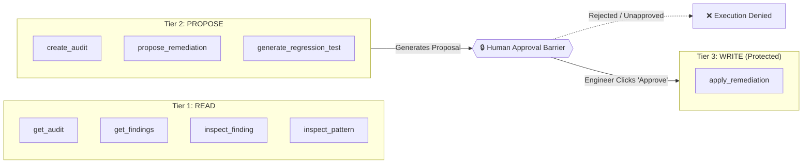

# ♿ A11yFix Web — Agent-Native Accessibility QA & WebMCP Host

[](LICENSE)
[](https://angular.dev)
[](https://angular.dev/guide/signals)
[](https://www.w3.org/WAI/WCAG22/)
[](https://github.com/modelcontextprotocol)
[](https://vitest.dev)

> **A11yFix** is an agent-native, browser-hosted accessibility QA application built with **Angular 22**, **Angular Signals**, and **WebMCP** (`document.modelContext`). It provides an autonomous end-to-end accessibility workflow: **Detect $\rightarrow$ Understand $\rightarrow$ Propose $\rightarrow$ Approve $\rightarrow$ Fix $\rightarrow$ Verify $\rightarrow$ Prevent Regression**.

---

## 📑 Repositories & Architecture Overview

The A11yFix platform is decoupled into two dedicated repositories following clean architecture principles:

| Repository | Role | Tech Stack | Repository URL |
| :--- | :--- | :--- | :--- |
| **`A11yFix-Front`** *(This repo)* | Browser WebMCP Host, Signal Facades, WAI-ARIA Pattern Engine, Accessible UI | Angular 22, Signals, SCSS Tokens, Vitest, Storybook | [Frontend Repository](https://github.com/rcellas/A11yFix-Front) |
| **`A11yFix-back`** | Audit Scanner API, Playwright Headless Runner, axe-core engine, LLM Remediation | NestJS / Express, Playwright, axe-core, TypeScript | [Backend Repository](https://github.com/rcellas/A11yFix-back) |

---

## 🌐 Live Deployment & Cold Start Notice

> [!IMPORTANT]
> **Render Free Tier Cold Start Notice**:
> If the live deployment connects to a backend hosted on Render's free tier, the instance automatically sleeps after periods of inactivity.
> 
> The **initial audit request may take 30–50 seconds** while the backend container boots up. Subsequent requests execute at full speed.

---

## 🤖 WebMCP Host Implementation (`document.modelContext`)

A11yFix Web acts as a **browser-native WebMCP client host**. Rather than using server-side stdio or SSE protocols, tools are registered directly into the browser's JavaScript execution environment via `document.modelContext.registerTool` (with graceful fallback to `navigator.modelContext` and direct GUI execution).

### Tool Registration Standard

Every WebMCP tool in A11yFix implements the browser-native registration interface:

```typescript
// Browser-Native WebMCP Registration in A11yFix Web
document.modelContext.registerTool({
  name: "propose_remediation",
  description: "Generate a context-aware WAI-ARIA APG remediation proposal and code diff for an accessibility finding",
  inputSchema: {
    type: "object",
    properties: {
      findingId: {
        type: "string",
        description: "The unique identifier of the accessibility finding"
      },
      proposedHtml: {
        type: "string",
        description: "Optional custom HTML replacement"
      },
      explanation: {
        type: "string",
        description: "Technical rationale referencing WCAG 2.2 criteria"
      }
    },
    required: ["findingId"]
  },
  execute: async (input: { findingId: string; proposedHtml?: string; explanation?: string }) => {
    // Executes via RemediationFacade and updates Signal state
    return await remediationFacade.requestAiRemediation(auditId, input.findingId);
  }
});
```

### 🛡️ Permission Tiers & Mandatory Human Approval Barrier

WebMCP tools are categorized into three strict security tiers:



1. **`READ`**: `get_audit`, `get_findings`, `inspect_finding`, `inspect_pattern`.
2. **`PROPOSE`**: `create_audit`, `propose_remediation`, `generate_regression_test`.
3. **`WRITE`**: `apply_remediation`.
   - **Mandatory Human Approval**: `apply_remediation` strictly **rejects** execution if human approval has not been granted in the application state. Automated agents cannot modify production code without verified human consent.

---

## ♿ WCAG 2.2 & WAI-ARIA APG Pattern Engine

A11yFix evaluates rules against the official **WCAG 2.2** specification (Levels A, AA, and AAA) and embeds an authoring practices guide for **9 interactive patterns**:

- 🗔 **Modal Dialog** (`dialog`): Focus trap, initial focus, escape key dismiss, focus return, `aria-modal="true"`.
- 📑 **Tabs** (`tabs`): Roving tabindex, arrow key navigation (Left/Right, Home, End), `role="tablist"`, `role="tab"`, `role="tabpanel"`.
- 📂 **Disclosure / Accordion** (`disclosure` / `accordion`): Toggle state via `aria-expanded` and `aria-controls`.
- 🔍 **Combobox** (`combobox`): Input with autocomplete listbox, `aria-activedescendant`, up/down keyboard navigation.
- 📋 **Menu Button** (`menu_button`): Popup actions menu with roving focus.
- 🍞 **Breadcrumb** (`breadcrumb`): Semantic `<nav aria-label="Breadcrumb">` with `<ol>` and `aria-current="page"`.
- 💬 **Tooltip** (`tooltip`): Focus/hover disclosure with Escape key dismissal.
- ⚠️ **Alert Dialog** (`alert_dialog`): Urgent confirmation modal with assertive announcements.

---

## 🚀 Getting Started

### Prerequisites
- **Node.js**: `v20.x` or later
- **Package Manager**: `pnpm` (recommended), `npm`, or `yarn`

### 1. Installation

```bash
# Clone the repository
git clone https://github.com/rcellas/A11yFix-Front.git
cd A11yFix-Front

# Install dependencies
pnpm install
```

### 2. Environment Configuration

Create or edit `src/environments/environment.ts` to point to your backend API:

```typescript
export const environment = {
  production: false,
  apiBaseUrl: 'http://localhost:3000' // Or your deployed A11yFix-back URL
};
```

### 3. Start Development Server

```bash
pnpm dev
# or: pnpm start
```

Navigate to `http://localhost:4200/` in your browser.

---

## 🎬 How It Works — End-to-End Workflow

### Step 1 — Submit a URL for Audit
Enter any public URL in the audit input field and click **"Run Audit"**. A11yFix sends the URL to the backend (axe-core + Playwright headless), which returns a structured accessibility report.

```
URL Input → Audit API → axe-core + Playwright scan → WCAG 2.2 findings
```

### Step 2 — Review Findings
The findings panel displays all violations sorted by severity (`critical`, `serious`, `moderate`, `minor`). Each finding shows:
- **WCAG 2.2 Success Criterion** (e.g. `1.4.3 Contrast (Minimum)`) with conformance level (A / AA / AAA)
- **Affected HTML element** and selector
- **WAI-ARIA APG Pattern card** (auto-detected for interactive widgets)

### Step 3 — AI Remediation Proposal
Click **"Propose AI Fix"** on any finding. A11yFix generates a **contextual HTML diff** showing exactly what needs to change, referencing the real DOM snippet from the audit.

### Step 4 — Human Approval (Mandatory Gate)
Review the diff in the **CodeDiffViewer**. Click **"Approve"** to confirm the proposal. The approval is recorded in the application state — without it, the apply step is locked.

### Step 5 — Apply & Verify
After approval, **"Apply Fix"** executes the `apply_remediation` WebMCP tool. A Playwright regression test is also auto-generated to prevent future regressions.

---

## 🖥️ WebMCP Console — Calling Tools & Reading Results

The **WebMCP Console** panel (right side of the workspace) exposes all 8 registered tools and a live telemetry log feed.

### How to invoke a tool from the console

1. Open the app at `http://localhost:4200/`
2. Run an audit scan first so findings are loaded
3. In the right panel, select the **"WebMCP Tools"** tab
4. Choose a tool card (e.g. `get_findings`, `propose_remediation`, `inspect_pattern`)
5. Fill in any required parameters shown in the input
6. Click **"Run ➔"**

### Reading results in the Telemetry Log

Switch to the **"Telemetry Log"** subtab to see structured output from every tool call:

```
● SUCCESS   propose_remediation   19:42:03
{
  "findingId": "axe:color-contrast:0",
  "originalHtml": "<span style=\"color: #aaa\">Text</span>",
  "proposedHtml": "<span style=\"color: #0f172a; background: #ffffff\">Text</span>",
  "explanation": "WCAG 2.2 SC 1.4.3 — contrast ratio raised from 2.1:1 to 15.3:1 (AAA)"
}
```

| Pill colour | Meaning |
|---|---|
| 🟢 `SUCCESS` | Tool executed successfully |
| 🔴 `DENIED` | `apply_remediation` called without human approval |
| 🟡 `FAILED` | Tool error (network, invalid input, etc.) |

### Inspecting WAI-ARIA Patterns from the console

1. Select the **`inspect_pattern`** tool card
2. In the **"Inspect Pattern:"** dropdown, choose one of the 9 patterns (or `All WAI-ARIA Patterns`)
3. Click **"Run ➔"**
4. The Telemetry Log shows the full W3C spec: required ARIA roles, attributes, and keyboard interaction requirements

### Resetting the session

Click **"Clear Logs"** or **"Reset"** — the console automatically returns to the **WebMCP Tools** tab, ready for the next interaction.

---

## 👥 Who Can Use A11yFix? — Three Access Layers

A11yFix is designed so that **WebMCP is one channel, not the only one**. The same audit engine, approval barrier, and WCAG 2.2 results are accessible through three different interfaces depending on who is using the tool:

| Who | How they interact | WebMCP needed? |
| :--- | :--- | :--- |
| **Non-developer** (designer, PM, QA analyst) | Uses the web UI directly: submits URL, browses findings, approves fixes | ❌ No |
| **Developer / Accessibility engineer** | Uses the WebMCP Console inside the app to call tools, inspect patterns, and read telemetry logs | ✅ Optional |
| **AI Agent** (Claude, Gemini, Copilot…) | Browser calls `document.modelContext` automatically — agent reads findings, proposes and applies fixes programmatically | ✅ Yes |

> [!IMPORTANT]
> Per the A11yFix design contract: **if WebMCP is unavailable or disabled in the browser, the application must function flawlessly for human users.** The GUI workflow is always the primary interface.

### How each profile experiences the same workflow

```
Non-developer  ──►  Web UI (Audit → Findings → Approve → Apply)
                         │
Developer      ──►  WebMCP Console  ──►  same Facades & State
                         │
AI Agent       ──►  document.modelContext  ──►  same Facades & State
                         │
                    ┌────┴────┐
                    │ 🔒 Human │  ◄── apply_remediation always requires
                    │Approval │       a human to click "Approve" first,
                    │ Barrier │       regardless of who triggered the tool
                    └─────────┘
```

### For non-developers: no setup needed

If you are not a developer and just want to audit a website:

1. Open the deployed app (or `http://localhost:4200/`)
2. Type a URL in the input field and press **"Run Audit"**
3. Browse the findings list — severity badges and WCAG references are in plain language
4. Click any finding to see the **AI-proposed fix** and the **before/after code diff**
5. Click **"Approve"** if the fix looks correct, then **"Apply Fix"**

The WebMCP Console panel is available but **entirely optional** for this workflow.

---

## 🧪 Testing & Verification


### Unit & Component Tests (Vitest)

All state machines, facades, WebMCP tools, and component logic are tested with Vitest:

```bash
# Run all unit tests (single run)
pnpm ng test --watch=false

# Run in watch mode
pnpm ng test
```

### Component Catalog & Isolated A11y Verification (Storybook)

Storybook is configured with `@storybook/addon-a11y` to verify component accessibility in isolation:

```bash
# Start Storybook server
pnpm storybook
```

Navigate to `http://localhost:6006/` to explore the **Design System** and **WAI-ARIA APG Pattern Catalog**.

---

## 🏗️ Architecture & Clean Code Guidelines

```text
src/app/
├── components/          # Atomic Design System (Badge, Button, Card, CodeDiffViewer, TextField, FilterChipGroup)
├── core/
│   ├── adapters/        # Infrastructure: HTTP client, Backend DTOs, Mappers, Contextual Remediation Helper
│   ├── facades/         # Application Layer: AuditFacade, RemediationFacade (Signals & Use Cases)
│   ├── models/          # Domain Layer: Finding, AuditReport, WCAG 2.2 Catalog, APG Patterns
│   ├── ports/           # Secondary Ports: AuditApiClient Port interface
│   ├── state/           # State Modeling: Discriminated unions (Idle, Scanning, Completed, Error, AwaitingApproval)
│   └── webmcp/          # WebMCP Host: Tool registry, polymorphic executors, document.modelContext bridge
├── design-system/       # Tokens: Colors, Typography (Inter, JetBrains Mono), Spacing, Elevation
└── features/            # Presentation Views: Audit Workspace, Findings List, Finding Detail, Compliance Success
```

---

## 📜 License

This project is licensed under the **MIT License** — see the [LICENSE](LICENSE) file for details.
